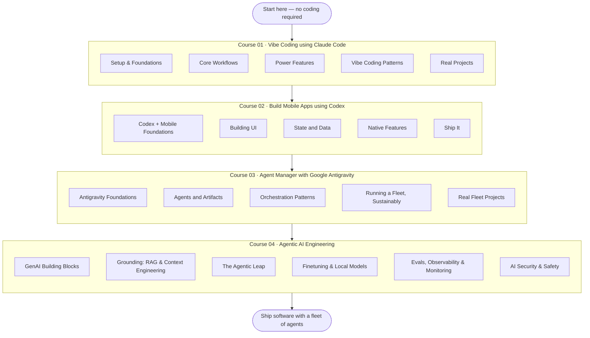

<!-- GENERATED FILE — do not edit by hand.
     Source: lib/courses.ts in the Vibe Code School site (scripts/export-oss.mts).
     Content PRs are welcome: edits get applied to the site source and re-exported. -->

# The Vibe Coding Roadmap (2026)

103 free lessons. Three agents. One path — from your first prompt to orchestrating
a fleet of AI agents. The interactive version with progress tracking lives at
**[vibecodeschool.com/roadmap](https://vibecodeschool.com/roadmap)**.

## The three tracks

### 01. Vibe Coding using Claude Code

From your first /init to capstone deploy. Claude Code as your daily driver: every prompt pattern, every workflow, every guardrail.

*Beginner · 28 lessons · ~14 hours · [take it interactively](https://vibecodeschool.com/courses/claude-code-vibe-coding) · [outline](../courses/claude-code-vibe-coding/README.md)*

1. **Setup & Foundations** — Install the CLI, learn the loop, set up project memory. End of this module you're operational.
2. **Core Workflows** — The day-to-day loops that make agentic coding faster than typing.
3. **Power Features** — Slash commands, skills, subagents, plan mode, hooks, and MCP — the tools that let you bend Claude Code to your workflow.
4. **Vibe Coding Patterns** — Prompts and rhythms that compound. The difference between a senior vibe coder and a tourist.
5. **Real Projects** — Full-loop case studies. Not toy examples — real shippable work.

### 02. Build Mobile Apps using Codex

React Native / Expo from scratch with Codex driving. Auth, payments, push notifications, native modules — all via prompts that produce real, reviewable code.

*Intermediate · 25 lessons · ~18 hours · [take it interactively](https://vibecodeschool.com/courses/codex-mobile-apps) · [outline](../courses/codex-mobile-apps/README.md)*

1. **Codex + Mobile Foundations** — Install Codex, scaffold an Expo app, understand the constraints of mobile vs web.
2. **Building UI** — Screens, navigation, forms, theming — the visible surface of your app.
3. **State and Data** — Local, global, offline, and live — how data moves through a real app.
4. **Native Features** — The capabilities that make it feel like a real app, not a wrapped website.
5. **Ship It** — From local sim to App Store / Play Store, with humans testing in between.

### 03. Agent Manager with Google Antigravity

Google Antigravity end to end: the Editor and Agent Manager surfaces, artifacts and browser verification, parallel agents across worktrees, knowledge that compounds — and the habits that make a fleet pay off.

*Advanced · 25 lessons · ~20 hours · [take it interactively](https://vibecodeschool.com/courses/antigravity-agent-manager) · [outline](../courses/antigravity-agent-manager/README.md)*

1. **Antigravity Foundations** — Install the IDE, meet the two surfaces, run your first Manager task, tune autonomy.
2. **Agents and Artifacts** — Plans, execution, verification, shipping, and the knowledge base — the working vocabulary of agent-first development.
3. **Orchestration Patterns** — Sequencing, parallel worktrees, second opinions, steering, and the inbox. The control flow of a fleet.
4. **Running a Fleet, Sustainably** — Models and rate limits, audit trails, failure modes, security, and the three metrics that keep leverage honest.
5. **Real Fleet Projects** — Issue → PR, docs sync, parallel triage, worktree migration, capstone. The workflows you'll actually run.

### 04. Agentic AI Engineering

From tokens to production: LLM fundamentals, RAG and context engineering, agent architectures with MCP and A2A, LangGraph orchestration, LoRA finetuning and local models with Ollama, evals and observability, and the security layer — injection defense, guardrails, red teaming, governance.

*Intermediate · 25 lessons · ~16 hours · [take it interactively](https://vibecodeschool.com/courses/agentic-ai) · [outline](../courses/agentic-ai/README.md)*

1. **GenAI Building Blocks** — Tokens, prompting, function calling, structured outputs, the modern stack — and the latency/cost/reliability budgets that shape everything.
2. **Grounding: RAG & Context Engineering** — Curate the window, anchor answers in your own data, and know which advanced retrieval patterns earn their complexity.
3. **The Agentic Leap** — From workflows to agents: architecture patterns, MCP for tools, A2A for peers, and LangGraph when orchestration gets real.
4. **Finetuning & Local Models** — When training pays off, LoRA/QLoRA in practice, and running open-weight models locally with Ollama.
5. **Evals, Observability & Monitoring** — Golden datasets, failure analysis, LLM-as-judge, tracing, and the production eval loop that catches regressions before users do.
6. **AI Security & Safety** — The threat surface, injection and PII defense, guardrails that fail closed, red teaming, and governance — production readiness, proven.

## FAQ

<strong>How do I start learning vibe coding in 2026?</strong>

Start with one agent and one real project. Our roadmap begins with Claude Code in your terminal: you learn the loop (describe an outcome, review the diff, correct, repeat), then prompt patterns, plan mode, hooks, and MCP. From there the path moves to shipping a mobile app with OpenAI Codex, and finally to orchestrating a fleet of agents with Google Antigravity.

<strong>How long does it take to learn vibe coding?</strong>

The full roadmap is roughly 68 hours of guided work — about 5 to 8 weeks part-time. Course 01 (Claude Code, ~14h) makes you productive in the first week; Course 02 (Codex mobile, ~18h) and Course 03 (Antigravity, ~20h) build toward shipping production software and running agents in parallel; Course 04 (Agentic AI Engineering, ~16h) teaches the systems layer — RAG, evals, and AI security.

<strong>Do I need to know how to code before starting?</strong>

No. Course 01 assumes zero coding background — the agent writes the code, and the course teaches you to specify, review, and steer. Basic web or mobile knowledge helps in the later courses, but every lesson explains the concepts it touches as they come up.

<strong>Is this vibe coding roadmap free?</strong>

Yes. All 103 lessons across the four courses are free, with no signup and no paywall. Progress, XP, streaks, and badges are saved in your browser.

<strong>Which AI coding tool should I learn first: Claude Code, Codex, or Cursor?</strong>

We recommend a terminal-first agent like Claude Code before an IDE like Cursor: it forces you to work at the level of intent instead of autocomplete, which is the core vibe coding skill. Codex and Antigravity then generalize that skill — the loop is the same, so switching tools later is cheap.

---

⭐ If this roadmap helps you, [star the repo](https://github.com/dineshxr/vibecodeschool) — it's how other learners find it.
